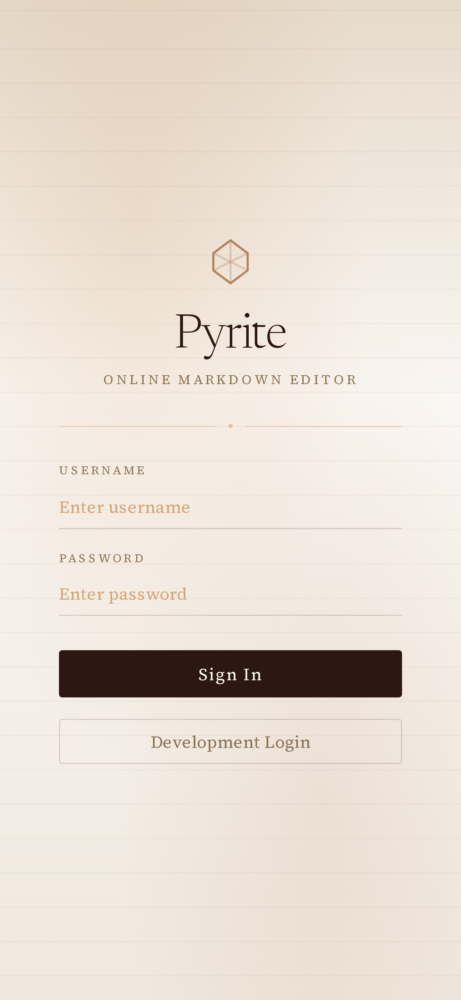
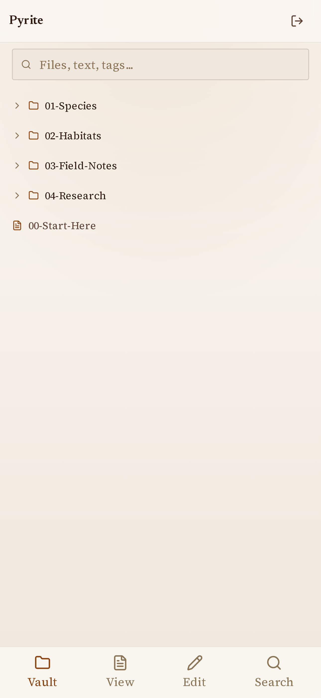
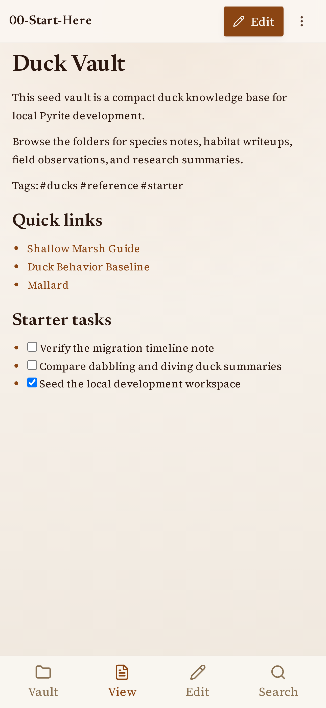
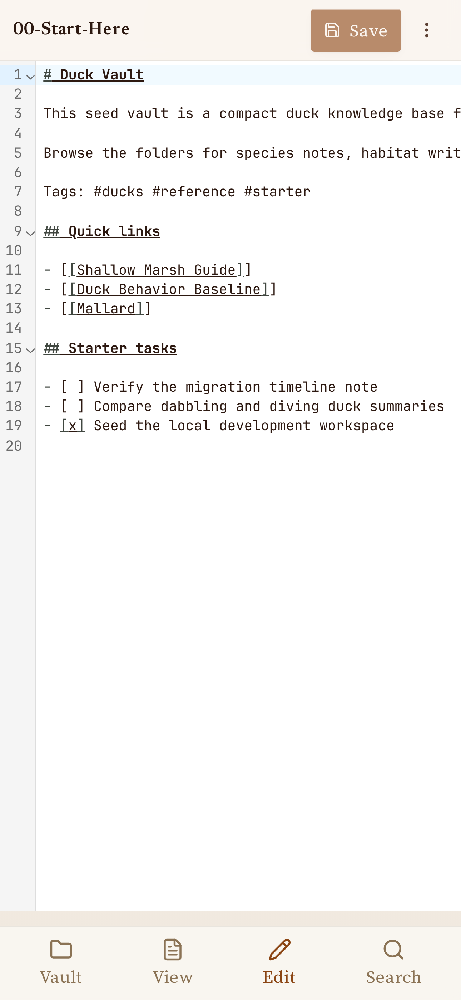
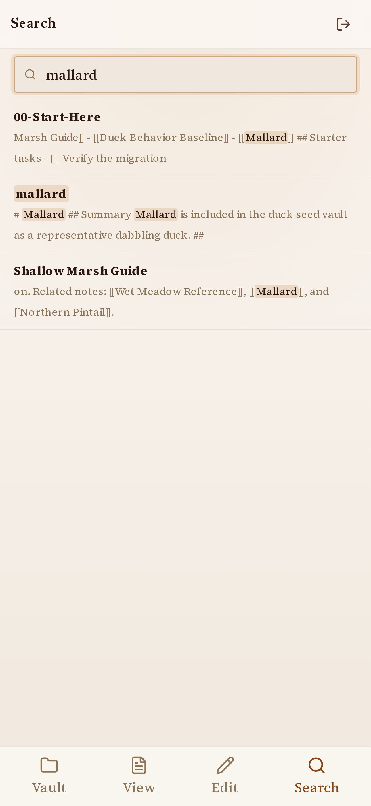

# Pyrite

[](CHANGELOG.md)

A single-user, mobile-first, self-hosted markdown vault editor. Mount an existing markdown vault, edit notes in place, and keep the filesystem as the single source of truth.

## Screenshots

| Login | Vault Tree | View | Edit | Search |
| --- | --- | --- | --- | --- |
| <a href="docs/readme-screenshots/login.png"></a> | <a href="docs/readme-screenshots/vault-tree.png"></a> | <a href="docs/readme-screenshots/view.png"></a> | <a href="docs/readme-screenshots/edit.png"></a> | <a href="docs/readme-screenshots/search.png"></a> |

## Deploy to TrueNAS

Use the Custom App (Docker Compose) option in TrueNAS. Replace the image, host path, and credentials for your environment.

```yaml
services:
  pyrite:
    image: ghcr.io/aduggleby/pyrite:latest
    restart: unless-stopped
    environment:
      PYRITE__VAULTROOT: /vault
      PYRITE__AUTH__USERNAME: alex
      PYRITE__AUTH__PASSWORDSHA256: "<sha256-hash>"
      PYRITE__UPLOADS__MAXBYTES: "10000000"
    volumes:
      - /mnt/tank/notes:/vault
    ports:
      - "18100:18100"
```

Generate the password hash (lowercase SHA-256 hex, no trailing newline):

```bash
printf '%s' "your-password" | openssl dgst -sha256 | awk '{print $2}'
```

### Reverse proxy

Terminate TLS at a reverse proxy and forward to port `18100`. Do not expose Pyrite directly to the public internet without an additional gate (VPN, SSO, or basic auth).

### Volume mount

Mount the vault read/write at the path set in `PYRITE__VAULTROOT`. Notes are UTF-8 text. Attachments go to `<vault>/.attachments/`.

## Docker (standalone)

```bash
docker run --rm \
  -p 18100:18100 \
  -e PYRITE__VAULTROOT=/vault \
  -e PYRITE__AUTH__USERNAME=alex \
  -e PYRITE__AUTH__PASSWORDSHA256="$(printf '%s' "password" | openssl dgst -sha256 | awk '{print $2}')" \
  -v /path/to/your/vault:/vault \
  pyrite
```

## Development

```bash
./run-dev.sh          # Docker dev stack with live-reload (tmux)
./stop-dev.sh         # stop the stack
./stop-dev.sh --volumes  # stop and reset vault to seed data
```

The dev stack runs the API on `localhost:18100` and Vite on `localhost:18110`. A seed vault in `dev/duck-vault` is copied to `.dev-workspace/` on first run. Set `PYRITE_NO_TMUX=1` to skip interactive tmux.

Without Docker:

```bash
dotnet run --project src/Pyrite.Api/Pyrite.Api.csproj --launch-profile http
cd src/pyrite-web && npm install && npm run dev
```

### Tests

```bash
dotnet test Pyrite.slnx     # backend
cd src/pyrite-web && npm test  # frontend
./test-app.sh                # browser E2E
```

### Build and publish (ANDO)

```bash
ando run                           # verify
ando run -p publish --dind         # publish to ghcr.io/aduggleby/pyrite
ando release [patch|minor|major]   # tag and release
```
