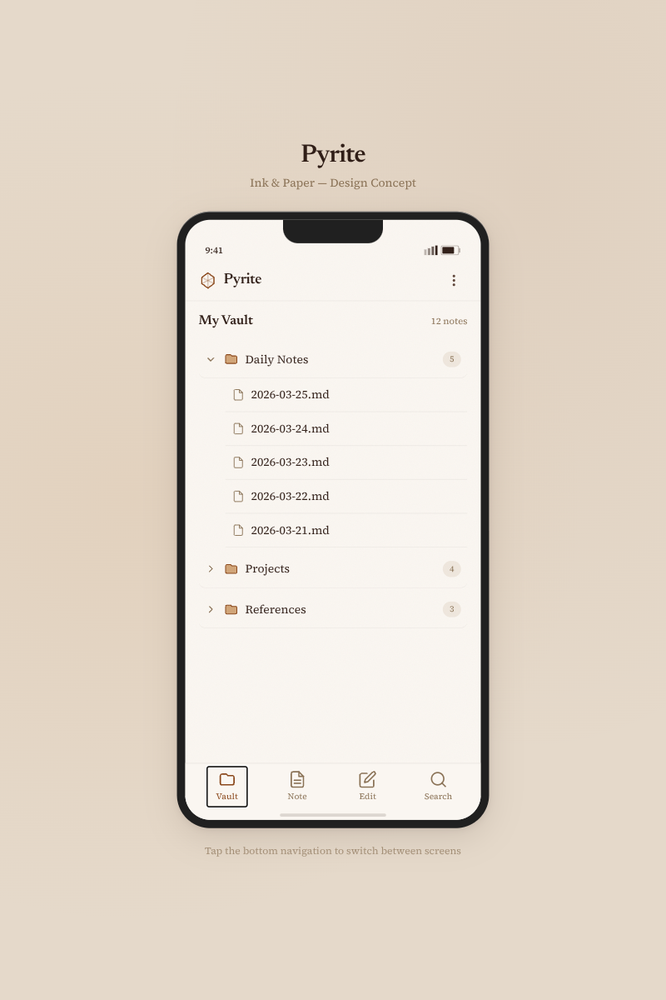
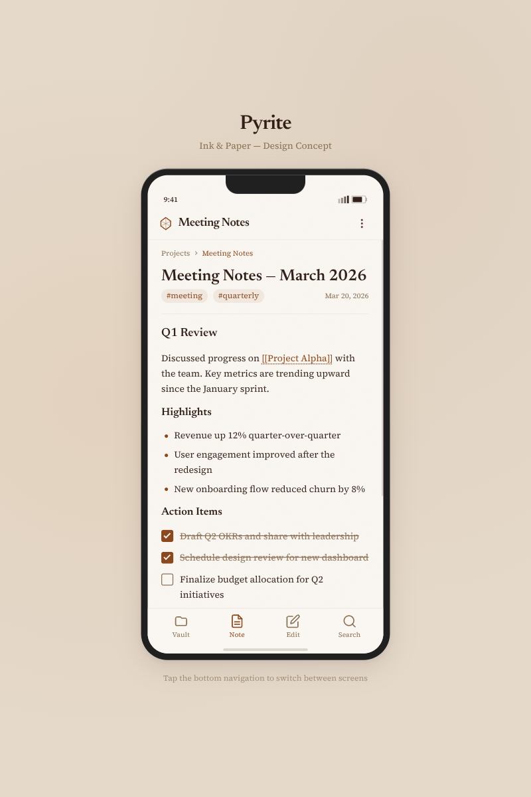
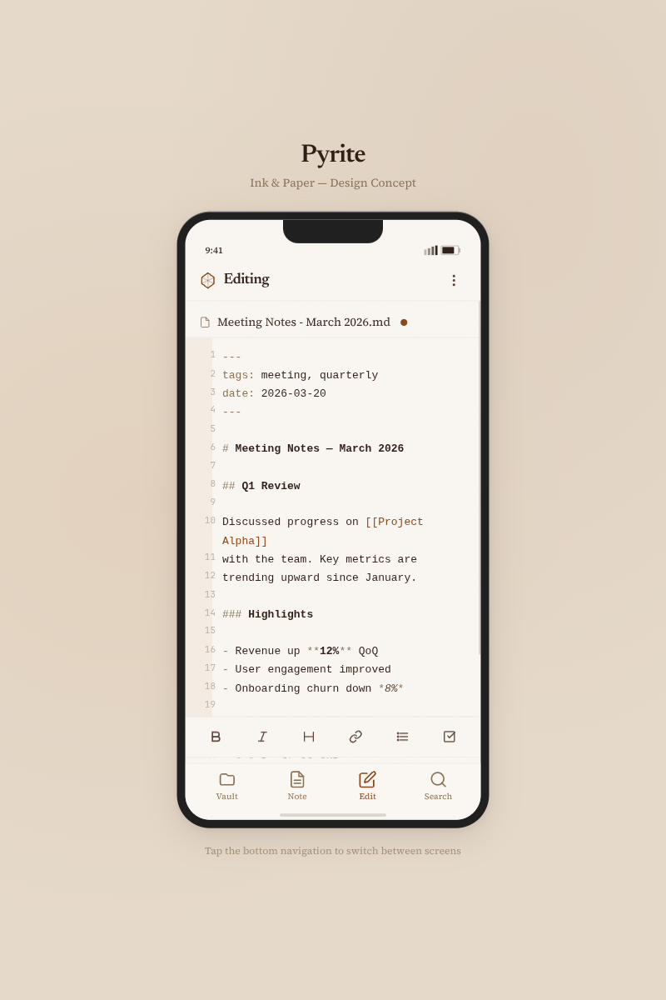
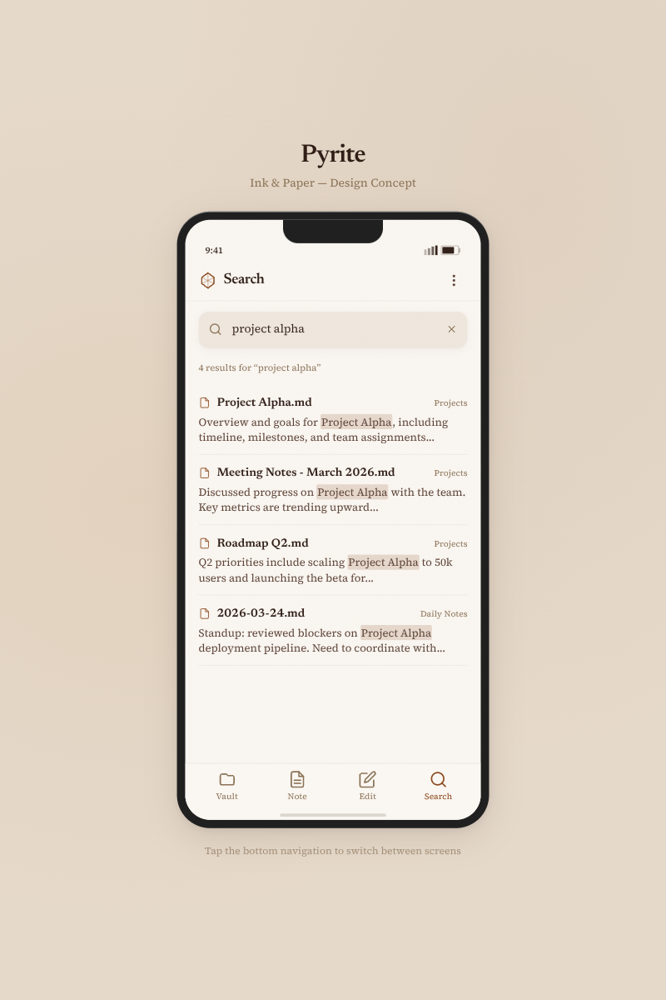

# Pyrite Style Guide — "Ink & Paper"

This is the authoritative visual design reference for the Pyrite frontend. Every UI element, color, font choice, spacing value, and component pattern documented here should be followed when building React components with `shadcn/ui` and Tailwind CSS.

The design concept is **"Ink & Paper"** — a warm, editorial aesthetic inspired by aged parchment, serif typography, and the tactile feel of handwritten notebooks. The UI should feel like a premium leather-bound journal rendered in a browser.

**Reference mockup:** [`/designs/01-ink-and-paper.html`](/home/alex/Source/Pyrite/designs/01-ink-and-paper.html)

---

## Screenshots

### Vault Browser


### Note View


### Editor


### Search


---

## Color Palette

All colors are defined as CSS custom properties / Tailwind config values. Use these semantic names, never raw hex values in components.

### Core Colors

| Token | Hex | Usage |
|-------|-----|-------|
| `parchment` | `#FAF6F1` | Primary background, phone screen bg, input bg |
| `parchment-dark` | `#F0E8DE` | Secondary background, badges, search input bg |
| `parchment-deeper` | `#E6DACB` | Page-level background behind the app shell |
| `ink` | `#2C1810` | Primary text, headings, body copy |
| `ink-light` | `#5C4033` | Secondary text, search snippets |
| `ink-muted` | `#8B7355` | Tertiary text, timestamps, metadata, line numbers |
| `accent` | `#8B4513` | Links, wikilinks, active nav, checked checkboxes, accent dots |
| `accent-light` | `#A0522D` | Hover states on accent elements |
| `accent-pale` | `#D2A679` | Focus rings, folder icon fills, subtle accents |

### Tailwind Config

```js
// tailwind.config.ts
export default {
  theme: {
    extend: {
      colors: {
        parchment: {
          DEFAULT: '#FAF6F1',
          dark: '#F0E8DE',
          deeper: '#E6DACB',
        },
        ink: {
          DEFAULT: '#2C1810',
          light: '#5C4033',
          muted: '#8B7355',
        },
        accent: {
          DEFAULT: '#8B4513',
          light: '#A0522D',
          pale: '#D2A679',
        },
      },
    },
  },
};
```

### Usage Rules

- **Never use pure black** (`#000`) or pure white (`#FFF`). The warmest dark is `ink` (`#2C1810`), the lightest surface is `parchment` (`#FAF6F1`).
- **Accent is used sparingly.** It marks interactive elements (links, active states, checkboxes) but should never dominate a surface.
- **Borders use transparency**, not solid gray. The standard ruled line is `rgba(44, 24, 16, 0.08)` — this keeps them warm-toned.

```tsx
// Good: warm transparent border
<div className="border-b border-ink/8" />

// Bad: cold gray border
<div className="border-b border-gray-200" />
```

---

## Typography

### Font Stack

| Role | Family | Google Fonts | Fallback |
|------|--------|-------------|----------|
| **Headings** | Newsreader | `Newsreader:ital,opsz,wght@0,6..72,300..800;1,6..72,300..800` | Georgia, serif |
| **Body** | Source Serif 4 | `Source+Serif+4:ital,opsz,wght@0,8..60,300..700;1,8..60,300..700` | Georgia, serif |
| **Editor / Code** | SF Mono | System font | Fira Code, Courier New, monospace |

### Tailwind Font Config

```js
// tailwind.config.ts (extend fontFamily)
fontFamily: {
  heading: ['Newsreader', 'Georgia', 'serif'],
  body: ['"Source Serif 4"', 'Georgia', 'serif'],
  mono: ['"SF Mono"', '"Fira Code"', '"Courier New"', 'monospace'],
},
```

### Type Scale

| Element | Class | Size | Weight | Line Height |
|---------|-------|------|--------|-------------|
| App title (header) | `font-heading text-lg font-semibold tracking-tight` | 18px | 600 | 1.5 |
| Note title (h1) | `font-heading text-2xl font-semibold leading-tight` | 24px | 600 | 1.25 |
| Section heading (h2) | `font-heading text-lg font-semibold` | 18px | 600 | 1.5 |
| Subsection (h3) | `font-heading text-base font-semibold` | 16px | 600 | 1.5 |
| Body text | `font-body text-sm leading-relaxed` | 14px | 400 | 1.625 |
| Small / metadata | `text-[11px] text-ink-muted` | 11px | 400 | 1.4 |
| Tag pill text | `text-xs` (12px) | 12px | 400 | 1.4 |
| Badge count | `text-[10px]` | 10px | 400 | 1.4 |
| Nav label | `text-[10px]` | 10px | 400 | 1.4 |
| Editor line | `font-mono text-[13px] leading-[1.7]` | 13px | 400 | 1.7 |
| Line number | `font-mono text-[11px]` | 11px | 400 | — |

### Usage Examples

```tsx
{/* Note title */}
<h1 className="font-heading text-2xl font-semibold text-ink leading-tight">
  Meeting Notes — March 2026
</h1>

{/* Section heading */}
<h2 className="font-heading text-lg font-semibold text-ink mt-2">
  Q1 Review
</h2>

{/* Body paragraph */}
<p className="font-body text-sm text-ink leading-relaxed">
  Discussed progress on <WikiLink>Project Alpha</WikiLink> with the team.
</p>

{/* Metadata line */}
<span className="text-[11px] text-ink-muted">Mar 20, 2026</span>
```

---

## Spacing & Layout

### Mobile-First Principles

- **Primary target:** 375px viewport width (iPhone SE/13 mini class)
- **All tap targets:** minimum 44px height/width (48px preferred for nav)
- **Content padding:** `px-4` (16px) for general screens, `px-5` (20px) for note view
- **Bottom nav clearance:** account for `env(safe-area-inset-bottom)` + home indicator

### Spacing Scale

| Context | Value | Tailwind |
|---------|-------|----------|
| Section gap | 12px | `space-y-3` |
| List item gap | 6px | `space-y-1.5` |
| Task item gap | 10px | `space-y-2.5` |
| Inline icon gap | 8px | `gap-2` |
| Tag gap | 8px | `gap-2` |
| Screen top padding | 12px | `pt-3` |
| Screen bottom padding | 16px | `pb-4` |
| Separator (ruled line) | full-width `border-b` | `border-b border-ink/8` |

### Content Hierarchy Spacing

```tsx
{/* Vault browser: folder row */}
<button className="flex items-center gap-2 w-full py-3 px-2 rounded-lg">
  {/* 12px vertical padding per row for comfortable tapping */}
</button>

{/* Vault browser: file row (child) */}
<a className="flex items-center gap-2 py-2.5 px-2 ml-8">
  {/* Indented 32px from parent, 10px vertical padding */}
</a>

{/* Note view: content sections */}
<div className="font-body text-sm text-ink leading-relaxed space-y-3">
  {/* 12px between paragraphs and sections */}
</div>
```

---

## Shadows & Surfaces

The design avoids harsh borders in favor of warm, paper-like shadows.

### Shadow Tokens

```css
/* Standard paper shadow — cards, inputs */
.paper-shadow {
  box-shadow:
    0 1px 2px rgba(44, 24, 16, 0.06),
    0 4px 12px rgba(44, 24, 16, 0.04),
    inset 0 1px 0 rgba(255, 255, 255, 0.5);
}

/* Elevated shadow — phone frame, modals, dropdowns */
.paper-shadow-lg {
  box-shadow:
    0 2px 8px rgba(44, 24, 16, 0.08),
    0 12px 40px rgba(44, 24, 16, 0.12),
    inset 0 1px 0 rgba(255, 255, 255, 0.4);
}
```

### Tailwind Plugin (or utility classes)

```tsx
{/* Search input with paper shadow */}
<input className="w-full pl-10 pr-4 py-3 rounded-xl bg-parchment-dark
  font-body text-sm text-ink placeholder-ink-muted
  shadow-[0_1px_2px_rgba(44,24,16,0.06),0_4px_12px_rgba(44,24,16,0.04)]
  focus:outline-none focus:ring-2 focus:ring-accent-pale" />
```

### Paper Texture Overlay

Apply to the main app shell for a subtle paper grain:

```css
.paper-texture::before {
  content: '';
  position: absolute;
  inset: 0;
  background-image: url("data:image/svg+xml,%3Csvg width='100' height='100' xmlns='http://www.w3.org/2000/svg'%3E%3Cfilter id='n'%3E%3CfeTurbulence type='fractalNoise' baseFrequency='0.75' numOctaves='4' stitchTiles='stitch'/%3E%3C/filter%3E%3Crect width='100' height='100' filter='url(%23n)' opacity='0.03'/%3E%3C/svg%3E");
  pointer-events: none;
  z-index: 1;
}
```

### Background Gradient

The page-level background behind the app uses a warm gradient mesh:

```css
body {
  background: #E6DACB;
  background-image:
    radial-gradient(ellipse at 20% 50%, rgba(210, 166, 121, 0.15) 0%, transparent 60%),
    radial-gradient(ellipse at 80% 20%, rgba(139, 69, 19, 0.06) 0%, transparent 50%);
}
```

---

## Ruled Lines (Dividers)

Instead of visible borders, use thin "ruled lines" to separate content — like lines on notebook paper.

```css
.ruled-line {
  border-bottom: 1px solid rgba(44, 24, 16, 0.08);
}
```

```tsx
{/* As a Tailwind class */}
<div className="border-b border-ink/[0.08]" />

{/* Between file list items */}
<a className="flex items-center gap-2 py-2.5 px-2 border-b border-ink/[0.08]">
  <FileIcon />
  <span className="font-body text-sm text-ink">2026-03-25.md</span>
</a>
```

---

## Components

### App Header Bar

The header shows the app icon, contextual title, and an overflow menu button.

```tsx
<div className="flex items-center justify-between px-4 py-2 border-b border-ink/[0.08]">
  <div className="flex items-center gap-2">
    <PyriteIcon className="w-[22px] h-[22px] text-accent" />
    <span className="font-heading text-lg font-semibold text-ink tracking-tight">
      {title}
    </span>
  </div>
  <button className="w-8 h-8 flex items-center justify-center rounded-full">
    <MoreVerticalIcon className="w-[18px] h-[18px] text-ink-light" />
  </button>
</div>
```

**Title changes contextually:** "Pyrite" on vault, note name on note view, "Editing" on editor, "Search" on search.

### Bottom Navigation Bar

4-item bottom nav with icon + label. Active state uses `accent` color.

```tsx
<nav className="fixed bottom-0 left-0 right-0 bg-parchment border-t border-ink/[0.1]"
     style={{ paddingBottom: 'env(safe-area-inset-bottom, 8px)' }}>
  <div className="flex items-center justify-around px-2 pt-1">
    {navItems.map(item => (
      <button
        key={item.id}
        className={cn(
          "min-h-[48px] min-w-[48px] flex flex-col items-center justify-center gap-0.5",
          "font-body text-[10px] transition-colors duration-200",
          isActive ? "text-accent" : "text-ink-muted"
        )}
        onClick={() => navigate(item.route)}
      >
        <item.icon className="w-[22px] h-[22px]" />
        <span>{item.label}</span>
      </button>
    ))}
  </div>
  {/* Home indicator */}
  <div className="mx-auto mt-2 mb-1 w-32 h-1 rounded-full bg-ink/[0.15]" />
</nav>
```

**Nav items:** Vault (folder icon), Note (file-text icon), Edit (edit icon), Search (search icon).

### Breadcrumb

Used at the top of note view to show folder context.

```tsx
<div className="flex items-center gap-1 text-[11px] text-ink-muted mb-3">
  <span>Projects</span>
  <ChevronRightIcon className="w-[10px] h-[10px]" />
  <span className="text-accent">Meeting Notes</span>
</div>
```

### File Tree — Folder Row

Collapsible folder with chevron arrow, folder icon, name, and file count badge.

```tsx
<button
  className="flex items-center gap-2 w-full py-3 px-2 rounded-lg text-left
             border-b border-ink/[0.08]"
  onClick={() => toggleFolder(folderId)}
>
  <ChevronRightIcon
    className={cn(
      "w-3.5 h-3.5 text-ink-muted transition-transform duration-300",
      isOpen && "rotate-90"
    )}
  />
  <FolderIcon className="w-[18px] h-[18px] fill-accent-pale stroke-accent" />
  <span className="font-body text-sm text-ink flex-1">{folderName}</span>
  <span className="text-[10px] bg-parchment-dark text-ink-muted rounded-full px-2 py-0.5">
    {fileCount}
  </span>
</button>
```

### File Tree — File Row

Child items indented under their folder.

```tsx
<a
  href={filePath}
  className="flex items-center gap-2 py-2.5 px-2 ml-8
             border-b border-ink/[0.08]"
>
  <FileIcon className="w-[15px] h-[15px] text-ink-muted" />
  <span className="font-body text-sm text-ink">{fileName}</span>
</a>
```

### File Tree — Expand/Collapse Animation

Children animate open with max-height transition:

```css
.folder-children {
  overflow: hidden;
  max-height: 0;
  transition: max-height 0.35s ease, opacity 0.3s ease;
  opacity: 0;
}
.folder-children.open {
  max-height: 500px;
  opacity: 1;
}
```

### Wikilink

Inline link styled with dotted underline in accent color.

```tsx
<span
  className="text-accent underline decoration-dotted underline-offset-[3px] cursor-pointer"
  onClick={() => navigateToNote(target)}
>
  [[{target}]]
</span>
```

```css
.wikilink {
  color: #8B4513;
  text-decoration: underline;
  text-decoration-style: dotted;
  text-underline-offset: 3px;
  cursor: pointer;
}
```

### Tag Pill

Small rounded pill for note tags.

```tsx
<span className="inline-block px-2 py-0.5 bg-accent/[0.08] text-accent
                 rounded-[10px] text-xs leading-snug">
  #{tagName}
</span>
```

```css
.tag-pill {
  display: inline-block;
  padding: 2px 8px;
  background: rgba(139, 69, 19, 0.08);
  color: #8B4513;
  border-radius: 10px;
  font-size: 12px;
  line-height: 1.4;
}
```

### Task Checkbox

Custom styled checkbox matching the paper aesthetic.

```tsx
<label className="flex items-start gap-2.5 cursor-pointer">
  <input
    type="checkbox"
    checked={isChecked}
    onChange={onToggle}
    className="appearance-none w-[18px] h-[18px] border-[1.5px] border-ink-muted
               rounded-[3px] bg-parchment cursor-pointer flex-shrink-0 mt-0.5
               checked:bg-accent checked:border-accent
               relative"
  />
  <span className={cn(
    isChecked && "line-through text-ink-muted"
  )}>
    {taskText}
  </span>
</label>
```

```css
.task-check {
  appearance: none;
  width: 18px;
  height: 18px;
  border: 1.5px solid #8B7355;
  border-radius: 3px;
  background: #FAF6F1;
  cursor: pointer;
  flex-shrink: 0;
}
.task-check:checked {
  background: #8B4513;
  border-color: #8B4513;
}
.task-check:checked::after {
  content: '';
  position: absolute;
  left: 5px;
  top: 1px;
  width: 5px;
  height: 10px;
  border: solid #FAF6F1;
  border-width: 0 2px 2px 0;
  transform: rotate(45deg);
}
```

### Bullet List

Uses accent-colored circle bullets.

```tsx
<ul className="space-y-1.5 ml-1">
  {items.map(item => (
    <li key={item} className="flex items-start gap-2">
      <span className="text-accent mt-0.5 text-xs leading-relaxed">&#9679;</span>
      <span>{item}</span>
    </li>
  ))}
</ul>
```

### Search Input

Rounded input with search icon and clear button.

```tsx
<div className="relative mb-4">
  <SearchIcon className="absolute left-3 top-1/2 -translate-y-1/2 text-ink-muted w-4 h-4" />
  <input
    type="text"
    placeholder="Search vault..."
    className="w-full pl-10 pr-4 py-3 rounded-xl bg-parchment-dark
               font-body text-sm text-ink placeholder-ink-muted
               paper-shadow
               focus:outline-none focus:ring-2 focus:ring-accent-pale"
  />
  {query && (
    <button className="absolute right-3 top-1/2 -translate-y-1/2 text-ink-muted">
      <XIcon className="w-3.5 h-3.5" />
    </button>
  )}
</div>
```

### Search Result

Each result shows file icon, filename, folder badge, and a content snippet with highlighted matches.

```tsx
<div className="py-3 border-b border-ink/[0.08]">
  <div className="flex items-center gap-2 mb-1">
    <FileIcon className="w-3.5 h-3.5 text-accent" />
    <span className="font-heading text-sm font-semibold text-ink">{fileName}</span>
    <span className="text-[10px] text-ink-muted ml-auto">{folderName}</span>
  </div>
  <p className="font-body text-[13px] text-ink-light leading-snug">
    {renderHighlightedSnippet(snippet, query)}
  </p>
</div>
```

### Search Highlight

```css
.search-highlight {
  background: rgba(139, 69, 19, 0.18);
  border-radius: 2px;
  padding: 0 1px;
}
```

```tsx
<mark className="bg-accent/[0.18] rounded-sm px-px">{matchedText}</mark>
```

### Editor — File Tab Bar

Shows the file being edited with an unsaved-changes indicator.

```tsx
<div className="flex items-center gap-2 px-4 py-2 border-b border-ink/[0.08]">
  <FileIcon className="w-3.5 h-3.5 text-ink-muted" />
  <span className="font-body text-sm text-ink">{fileName}</span>
  {isDirty && (
    <span className="w-2 h-2 rounded-full bg-accent ml-1" title="Unsaved changes" />
  )}
</div>
```

### Editor — Line Numbers + Content

The editor gutter has a warm-toned background strip on the left.

```tsx
<div
  className="px-3 pt-3 pb-4 space-y-0"
  style={{ background: 'linear-gradient(to right, #F5EDE4 32px, transparent 32px)' }}
>
  {lines.map((line, i) => (
    <div key={i} className="flex gap-2 items-start">
      <span className="font-mono text-[11px] text-ink-muted/50 select-none min-w-[24px] text-right">
        {i + 1}
      </span>
      <span className="font-mono text-[13px] leading-[1.7] text-ink">
        {renderSyntaxHighlighting(line)}
      </span>
    </div>
  ))}
</div>
```

### Editor — Syntax Colors

| Element | Class/Color | Description |
|---------|------------|-------------|
| Markdown syntax (`#`, `**`, `-`) | `text-ink-muted` (`#8B7355`) | Dim the markup characters |
| Heading text | `text-ink font-semibold` | Bold, full ink |
| Bold text | `text-ink font-bold` | Heavy weight |
| Italic text | `text-ink-light italic` | Lighter tone, italic |
| Wikilinks | `text-accent` (`#8B4513`) | Accent-colored |
| Cursor | 1.5px wide, `bg-ink`, blinking | Thin ink-colored cursor |

### Editor — Cursor Blink

```css
.cursor-blink {
  display: inline-block;
  width: 1.5px;
  height: 1.1em;
  background: #2C1810;
  animation: blink 1s step-end infinite;
  vertical-align: text-bottom;
}
@keyframes blink {
  50% { opacity: 0; }
}
```

### Editor — Bottom Toolbar

Formatting buttons pinned to the bottom, above the nav bar.

```tsx
<div className="sticky bottom-0 bg-parchment border-t border-ink/[0.1]">
  <div className="flex items-center justify-around px-2 py-1">
    {toolbarItems.map(item => (
      <button
        key={item.id}
        className="min-w-[40px] min-h-[40px] flex items-center justify-center
                   rounded-md text-ink-light transition-colors
                   hover:bg-ink/[0.06] active:bg-ink/[0.06]"
        title={item.label}
      >
        <item.icon className="w-4 h-4" />
      </button>
    ))}
  </div>
</div>
```

**Toolbar items:** Bold, Italic, Heading, Link, List, Checkbox

### Badge / Count Pill

File count badges in the folder tree.

```tsx
<span className="text-[10px] bg-parchment-dark text-ink-muted rounded-full px-2 py-0.5">
  {count}
</span>
```

---

## Animations & Transitions

### Screen Transition (Tab Switch)

Fade-in with a subtle upward slide when switching between screens.

```css
@keyframes fadeIn {
  from { opacity: 0; transform: translateY(4px); }
  to { opacity: 1; transform: translateY(0); }
}

.tab-panel {
  animation: fadeIn 0.3s ease-in-out;
}
```

### Folder Expand/Collapse

```css
.folder-children {
  overflow: hidden;
  max-height: 0;
  transition: max-height 0.35s ease, opacity 0.3s ease;
  opacity: 0;
}
.folder-children.open {
  max-height: 500px;
  opacity: 1;
}
```

### Chevron Rotation

```tsx
<ChevronRightIcon
  className={cn(
    "transition-transform duration-300",
    isOpen && "rotate-90"
  )}
/>
```

### Nav Button Color Transition

```css
.nav-btn {
  transition: color 0.2s ease;
}
```

### General Rules

- Keep transitions under **350ms** — the app should feel responsive, not cinematic.
- Use `ease` or `ease-in-out` curves. No bounce or spring effects.
- Only animate **opacity, transform, max-height, and color**. Avoid animating layout properties.

---

## Icons

Use stroke-style icons (Lucide or similar) at these sizes:

| Context | Size | Stroke Width |
|---------|------|-------------|
| Nav bar | 22px | 1.8 |
| File tree folder | 18px | 1.5 |
| File tree file | 15px | 1.5 |
| Toolbar button | 16px | 2 |
| Breadcrumb chevron | 10px | 2 |
| Search input icon | 16px | 2 |
| Header menu dots | 18px | 2 |

### Folder Icon (Filled + Stroked)

The folder icon uses a **filled** accent-pale body with an **accent** stroke:

```tsx
<FolderIcon className="w-[18px] h-[18px] fill-accent-pale stroke-accent stroke-[1.5]" />
```

### File Icon (Stroke Only)

```tsx
<FileIcon className="w-[15px] h-[15px] stroke-ink-muted stroke-[1.5] fill-none" />
```

---

## Scrollbar

Custom thin scrollbar for the content area:

```css
.phone-scroll::-webkit-scrollbar {
  width: 3px;
}
.phone-scroll::-webkit-scrollbar-track {
  background: transparent;
}
.phone-scroll::-webkit-scrollbar-thumb {
  background: rgba(44, 24, 16, 0.15);
  border-radius: 3px;
}
```

---

## Responsive Behavior

### Mobile (< 640px) — Primary Target

- Single column layout, full width
- Bottom nav visible at all times
- Editor toolbar sticky at bottom
- Content padding: 16-20px horizontal

### Tablet (640px - 1024px)

- Same layout as mobile but with more breathing room
- Consider side-by-side edit/preview split at wider breakpoints

### Desktop (> 1024px)

- App constrained to max-width container (centered)
- Sidebar file tree alongside note content
- Editor and preview can be shown simultaneously

---

## shadcn/ui Integration Notes

When using `shadcn/ui` components, override these defaults to match the Ink & Paper aesthetic:

### General Overrides

- **Border radius:** Use `rounded-lg` (8px) for cards, `rounded-xl` (12px) for inputs, `rounded-[10px]` for pills
- **Focus ring:** `focus:ring-2 focus:ring-accent-pale` (not the default blue)
- **Font:** All body text must use `font-body`, headings `font-heading`
- **Background:** Override any gray backgrounds with `parchment` variants

### Specific Components

```tsx
// shadcn Button — warm accent variant
<Button className="bg-accent text-parchment hover:bg-accent-light
                   font-body rounded-lg shadow-none" />

// shadcn Input — parchment-dark background
<Input className="bg-parchment-dark border-ink/[0.08] text-ink
                  font-body rounded-xl placeholder-ink-muted
                  focus:ring-2 focus:ring-accent-pale focus-visible:ring-accent-pale" />

// shadcn Dialog — paper shadow
<DialogContent className="bg-parchment paper-shadow-lg border-ink/[0.08]
                          font-body rounded-2xl" />

// shadcn DropdownMenu — warm styling
<DropdownMenuContent className="bg-parchment border-ink/[0.08] paper-shadow
                                font-body rounded-lg" />
<DropdownMenuItem className="text-ink hover:bg-ink/[0.04] focus:bg-ink/[0.04]
                             rounded-md cursor-pointer" />

// shadcn Checkbox — accent brown
<Checkbox className="border-ink-muted data-[state=checked]:bg-accent
                     data-[state=checked]:border-accent rounded-[3px]" />

// shadcn ScrollArea — thin warm scrollbar
<ScrollArea className="[&_[data-radix-scroll-area-thumb]]:bg-ink/[0.15]" />
```

---

## Do / Don't Quick Reference

| Do | Don't |
|----|-------|
| Use `parchment` background surfaces | Use pure white or gray backgrounds |
| Use `ink` for text (warm dark brown) | Use `#000` black or `text-gray-900` |
| Use `accent` (`#8B4513`) for links/active | Use blue for links |
| Use serif fonts (Newsreader, Source Serif 4) | Use Inter, Roboto, or system sans-serif |
| Use warm transparent borders (`border-ink/8`) | Use `border-gray-200` or solid borders |
| Use paper shadows with warm tones | Use standard Tailwind gray shadows |
| Keep animations under 350ms | Add bounce/spring/complex easing |
| Use dotted underline for wikilinks | Use solid underline or button-style links |
| Keep badge counts small (10px) | Make badges prominent or colorful |
| Use monospace only in editor context | Use monospace for UI labels |
